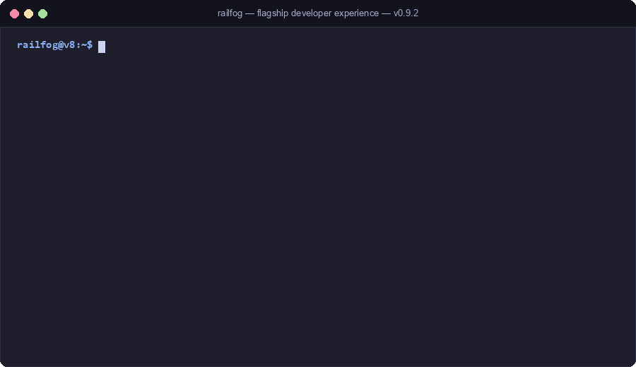

# RailFog Documentation Portal

> [!NOTE]
> **Runtime**: Deno v2.0+ Native Web Standards &nbsp;|&nbsp; **Specification**:
> [Unified Four-Primitives (CONCEPT-1)](contracts/concepts.contract.md) & [LTS Formal Contracts](contracts/platform.contract.md) &nbsp;|&nbsp;
> **Architecture**: Modular Monolith & Shared-Nothing Isolates &nbsp;|&nbsp;
> **Security**: Capability-Based (Zero Ambient Authority)

RailFog reduces backend application infrastructure to four fundamental concepts:

$$\mathbf{RailFog} = \{\mathbf{Compute},\, \mathbf{State},\, \mathbf{Data},\, \mathbf{Signal}\}$$

Mapped directly to four infrastructure primitives:

$$\begin{aligned}
\mathbf{Compute} &\longrightarrow \text{Function} && (\text{Execute / } \textit{transform}) \\
\mathbf{State} &\longrightarrow \text{KV} && (\text{Remember / } \textit{remember}) \\
\mathbf{Data} &\longrightarrow \text{Object} && (\text{Persist / } \textit{persist}) \\
\mathbf{Signal} &\longrightarrow \text{Queue} && (\text{Communicate / } \textit{communicate})
\end{aligned}$$

<p align="center">
  
</p>

---

## Documentation Navigation Map

docs/
├── concepts/           # Section 1: The Four Concepts (Compute, State, Data, Signal, Composition)
├── sdk/                # Section 2: TypeScript SDK (Compute, State, Data, Signal, Context)
├── composition/        # Section 3: Architecture Composition & Design Patterns
├── providers/          # Section 4: Pluggable Infrastructure Drivers (Compute, State, Data, Signal)
├── get-started/        # Fast-track onboarding and installation
├── guides/             # Everyday developer workflows
├── reference/          # Authoritative CLI, SDK, manifest, limits, error codes
├── architecture/       # Deep-dive internals and process topology
├── contributing/       # Contribution workflows and testing
├── contracts/          # Formal LTS Contracts (CONCEPT, PLAT, FN, KV, OBJ, Q, Worked Example)
├── adr/                # Architecture Decision Records (ADR-0001, ADR-0002, ADR-0005)
├── glossary.md         # Canonical platform terminology (single source of truth)
└── CONSTITUTION.md     # Architectural doctrine (The Boundary Rule)
```

---

## 1. Core Concepts

The developer mental model behind RailFog:

- [**Compute**](concepts/compute.md): Execution, transformation, validation, and decision making (`transform`).
- [**State**](concepts/state.md): Small, addressable, mutable state and optimistic CAS coordination (`remember`).
- [**Data**](concepts/data.md): Durable bulk byte persistence, streaming, and presigned direct transfers (`persist`).
- [**Signal**](concepts/signal.md): Asynchronous message dispatch, job queues, and event buffering (`communicate`).
- [**Composition Principle**](concepts/composition.md): Power through composition and the Primitive Addition Test.
- [**Conceptual Architecture**](concepts/architecture.md): Modular monolith and two-process physical deployment boundary (`PLAT-1`).
- [**Execution Model & Sandboxing**](concepts/execution-model.md): V8 isolates, request lifecycle (`FN-8`), and warm reuse (`FN-6`).
- [**Capability-Based Security**](concepts/capabilities.md): Zero ambient authority and deploy-time capability injection (`PLAT-6`).
- [**Immutable Revisions**](concepts/revisions.md): Content-addressed artifacts (`OBJ-4`) and state archives (`rail export`).
- [**Provider Abstractions**](concepts/providers.md): Pluggable SPI contracts (`PLAT-16`), local/cloud parity, and `TenantGuard` (`PLAT-4`).
- [**Defense-in-Depth Isolation**](concepts/isolation.md): V8 sandboxes, process containment, gVisor (`PLAT-7`), and egress firewall (`PLAT-5`).
- [**Consistency Tiers**](concepts/consistency.md): Linearizable strong consistency vs edge eventual consistency (`KV-5`).
- [**Failure Model & Reliability**](concepts/failure-model.md): Fail-static data plane (`PLAT-8`), circuit breaking, and DLQ routing.

---

## 2. TypeScript SDK (`@railfog/sdk`)

Developer-facing representation exposing capabilities, not cloud providers:

- [**SDK Overview**](sdk/overview.md): Four primitives mental model, zero-boilerplate handlers, and backwards compatibility.
- [**Compute SDK**](sdk/compute.md): `compute()`, `handle()`, `api()`, and `router()` function wrappers.
- [**State SDK**](sdk/state.md): `c.state.get/set/delete`, hierarchical tuple keys, and `atomic()` CAS commits.
- [**Data SDK**](sdk/data.md): `c.data.get/put/delete`, streaming `ReadableStream`, and `presign()` transfers.
- [**Signal SDK**](sdk/signal.md): `c.signal.send`, `consumer()` queue handlers, and automatic idempotency (`Q-4`).
- [**Complete SDK Reference**](reference/sdk.md): Full method signatures, `HandlerContext`, `ConsumerContext`, and reliability helpers.
- [**Canonical SDK Guide**](sdk-guide.md): Comprehensive developer guide with worked-example.

---

## 3. Architecture Composition

Constructing real-world distributed backends from the four primitives:

- [**Composition Overview**](composition/overview.md): Four primitives dependency direction and architecture doctrine.
- [**Composition Patterns**](composition/patterns.md): Caching, background jobs, streaming media, and event-driven workflows.
- [**Worked Example**](contracts/worked-example.md): Canonical multi-stage ingest $\to$ transform $\to$ record $\to$ export pipeline.

---

## 4. Pluggable Providers (`providers/`)

Infrastructure drivers executing computation and storage behind SPI contracts (`PLAT-16`):

- [**Provider Overview**](providers/overview.md): Dependency inversion hierarchy, `TenantGuard` (`PLAT-4`), and local/cloud parity.
- [**Compute Providers**](providers/compute.md): Sandboxed execution (`ProcessIsolationProvider`, `GvisorIsolationProvider`) and limits enforcement.
- [**State Providers**](providers/state.md): Key-Value storage drivers (SQLite, PostgreSQL, Redis, Cloudflare KV).
- [**Data Providers**](providers/data.md): Object storage drivers (Local filesystem, Cloudflare R2, AWS S3).
- [**Signal Providers**](providers/signal.md): Asynchronous queue drivers (SQLite, Redis, Cloudflare Queues, AWS SQS).

---

## 5. Getting Started

- [**Installation & Setup**](get-started/installation.md): Deno install, compiled native binary, and shell completions.
- [**5-Minute Quickstart**](get-started/quickstart.md): Install the CLI, scaffold a project, and run local dev.
- [**Standard Project Structure**](get-started/project-structure.md): File layout, `railfog.toml`, and entrypoint conventions.
- [**Platform Overview**](get-started/overview.md): Core philosophy and architectural tenets.

---

## 6. Developer Guides

- [**Local Development**](guides/local-development.md): Developing locally with `rail dev` and developer dashboard.
- [**Writing Functions**](guides/functions.md): Handlers, typed signatures, context accessors, and triggers.
- [**Key-Value Storage**](guides/kv.md): Structured state, hierarchical tuple keys, and atomic CAS.
- [**Object Storage**](guides/objects.md): Durable binary storage, direct transfers (`OBJ-3`), and zero-proxy rule.
- [**Asynchronous Queues**](guides/queues.md): Sending, consuming, retry policies, and dead-letter queues (`dlq`).
- [**URL Routing & Specificity**](guides/routing.md): Route declarations and `PLAT-11` specificity scoring.
- [**Secrets Management**](guides/secrets.md): Capability-scoped encrypted secrets and zero plaintext leakage.
- [**Testing Functions**](guides/testing.md): In-memory testing with `@railfog/sdk/testing` and `createMockContext`.
- [**Deployment Pipeline**](guides/deployment.md): Pre-deploy checks (`rail check`), packaging, and `rail deploy`.
- [**Instant Rollbacks**](guides/rollback.md): Zero-rebuild atomic pointer flips with `rail rollback`.
- [**WebAssembly Polyglot**](guides/wasm.md): High-performance Rust/C/Go execution inside V8 isolates.
- [**Troubleshooting & Diagnostics**](guides/troubleshooting.md): Platform diagnostics (`rail doctor`), error codes, and log filtering.

---

## 7. Reference Manuals

- [**CLI Reference**](reference/cli.md): Alphabetical reference for all 22 commands, options, and defaults.
- [**Configuration Reference**](reference/configuration.md) & [**Authoritative Manifest**](configuration-reference.md): Complete `railfog.toml` schema rules.
- [**TypeScript SDK Reference**](reference/sdk.md): Complete API reference for `@railfog/sdk`.
- [**Error Codes Taxonomy**](reference/error-codes.md): Exhaustive 10 machine-readable error codes (`PLAT-12`).
- [**Resource Limits & Ceilings**](reference/limits.md): Hard execution ceilings, CPU/memory quotas, and timeouts (`FN-5`).
- [**Environment Variables**](reference/environment.md): Platform server daemon and CLI environment variables.

---

## 8. System Architecture & Internals

- [**Process Topology Overview**](architecture/overview.md): Two-process deployment boundary (`PLAT-1`).
- [**Runtime Internals**](architecture/runtime.md): Sandboxed execution pipeline and limits enforcer.
- [**Control Plane Internals**](architecture/control-plane.md): Deployment compiler and revision registry.
- [**Data Plane Internals**](architecture/data-plane.md): Data-Oriented Design in hot path and snapshot caching.
- [**Provider SPI Architecture**](architecture/providers.md): Provider contracts, DIP/ISP/LSP rules, and `TenantGuard`.
- [**Multi-Region & Edge Topology**](architecture/multi-region-edge.md): Autonomous edge nodes and global anycast.
- [**Hot-Path Performance**](architecture/performance.md): Memory allocation avoidance and UDS transport.

---

## 9. Contracts, ADRs & Governance

- [**Canonical Glossary**](glossary.md): Mandatory domain vocabulary and definitions.
- [**Architectural Constitution**](CONSTITUTION.md): The Boundary Rule (SOLID at boundaries, DOD in hot paths).
- [**Architecture Decision Records**](adr/): ADR-0001, ADR-0002, and [ADR-0005](adr/ADR-0005-unified-four-primitives.md).
- [**Formal Contracts**](contracts/): [Concepts (`CONCEPT`)](contracts/concepts.contract.md), [Platform (`PLAT`)](contracts/platform.contract.md), [Functions (`FN`)](contracts/functions.contract.md), [KV (`KV`)](contracts/kv.contract.md), [Objects (`OBJ`)](contracts/objects.contract.md), [Queues (`Q`)](contracts/queues.contract.md), and [Worked Example](contracts/worked-example.md).
