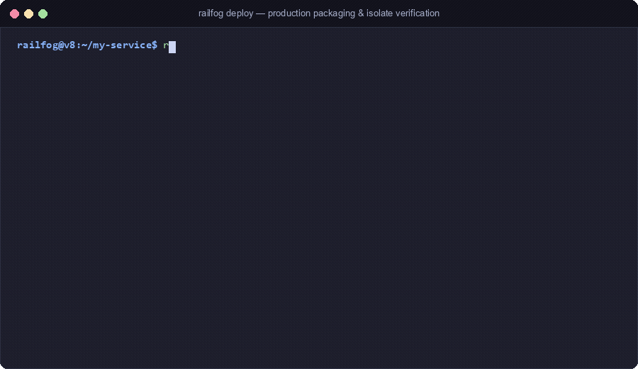

# Deployment Guide

> [!NOTE]
> **Documentation**: [Docs Home](../README.md) &nbsp;|&nbsp; **Specification**:
> [`PLAT-3`](../contracts/platform.contract.md#PLAT-3),
> [`FN-3`](../contracts/functions.contract.md#FN-3) &nbsp;|&nbsp; **CLI
> Command**: `rail deploy`

Deploying in RailFog compiles your application manifest, packages source code
into content-addressed immutable artifacts, pre-warms runtime sandboxes, and
executes an atomic traffic pointer flip with zero dropped connections.

---

## 1. The Deployment Pipeline (`PLAT-3`)

Every deployment follows a deterministic 6-step lifecycle:

```
┌─────────────────────────────────────────────────────────────┐
│                 DEPLOYMENT PIPELINE (PLAT-3)                │
│                                                             │
│  1. Validation: rail check parses railfog.toml & entrypoints│
│  2. Resolution: Capability matrix and secrets are compiled  │
│  3. Artifacts:  Source bundle is SHA-256 content-addressed  │
│  4. Revision:   Immutable revision record created (ULID)    │
│  5. Pre-warm:   Runtime isolates compile and cache module   │
│  6. Activation: Atomic traffic pointer flips to new revision│
└─────────────────────────────────────────────────────────────┘
```

---

## 2. Pre-Deployment Validation (`rail check`)

Before deploying, run `rail check` to validate your project statically:

```bash
rail check
```

`rail check` performs:

- Schema validation against `schemas/railfog.schema.json`
- Verifies that all `entry` files exist on disk
- Rejects path traversal (`..`) escaping project boundaries
- Checks for undeclared secrets referenced in source code (`PLAT-15`)
- Computes `PLAT-11` route specificity scores and flags conflicting duplicates
- Audits outbound network permissions against mandatory SSRF IP blocks
  (`PLAT-5`)

---

## 3. Authenticating (`rail login`)

Authenticate with the RailFog control plane before deploying:

```bash
rail login
```

Opens a secure OAuth authorization callback in your default browser. For
headless CI/CD environments, supply an API token directly:

```bash
export RAILFOG_API_KEY="rf_sec_live_..."
```

---

## 4. Deploying to Production (`rail deploy`)

Run `rail deploy` from the project root:

```bash
rail deploy
```



Sample output:

```text
Packaging upload-demo...
  Created artifact: sha256:d8b2e3... (42.1 KB)
  Compiled capability matrix: 1 function, 1 bucket, 1 queue
  Created revision: 01J8G5E1M2R4K7W9P0X1Y2Z3A4
  Pre-warming 3 edge isolates...
  Flipping live traffic pointer...

Deploy completed in 1.4s!
URL: https://upload-demo.edge.railfog.net
```

### CLI Flags for `rail deploy`

| Option                | Description                                            |
| --------------------- | ------------------------------------------------------ |
| `--project <name>`    | Override project identifier declared in `railfog.toml` |
| `--control-url <url>` | Custom Control Plane API endpoint                      |
| `--token <token>`     | Explicit API authentication token                      |
| `--json`              | Output machine-readable JSON summary for CI pipelines  |

---

## 5. Post-Deployment Verification

### Check Revision Status

```bash
rail status
```

Displays the active live revision ID, target routes, and deployment timestamp.

### Stream Runtime Logs

```bash
rail logs --follow
```

Streams real-time structured logs from edge runtime daemons with automatic
high-entropy secret redaction.

---

## Next Steps

- Learn how to [Perform Instant Rollbacks](rollback.md).
- Learn how to [Troubleshoot Common Issues](troubleshooting.md).
