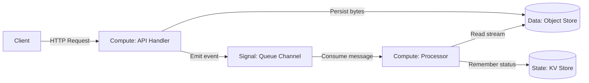

# TypeScript SDK Overview (`@railfog/sdk`)

> [!NOTE]
> **Documentation**: [Docs Home](../README.md) &nbsp;|&nbsp; **Package**:
> `@railfog/sdk` &nbsp;|&nbsp; **Runtime**: Deno v2.0+ &nbsp;|&nbsp;
> **Dependencies**: Zero External (Native Web Standards)

`@railfog/sdk` is the official TypeScript SDK for building functions, consumers,
and services on the RailFog edge platform.

---

## 1. Installation

Install into your RailFog project using the CLI:

```bash
rail add sdk
```

This injects `@railfog/sdk` into your `deno.json` import map:

```json
{
  "imports": {
    "@railfog/sdk": "https://raw.githubusercontent.com/MoustafaAt1a/railfog/main/sdk/typescript/mod.ts"
  }
}
```

---

## 2. The Four-Primitives Architecture (`CONCEPT-1` through `CONCEPT-4`)

RailFog reduces backend application infrastructure to four fundamental concepts:
**Compute**, **State**, **Data**, and **Signal** (`contracts/concepts.contract.md#CONCEPT-1`).

Complexity emerges from the composition of these four primitives, not from adding specialized infrastructure subsystems.

### 2.1 Developer Concept vs. Infrastructure Primitive (`CONCEPT-2`)

RailFog maintains a strict two-layer terminology model:

| Developer Concept | Infrastructure Primitive | Fundamental Action (`CONCEPT-3`) | Primary Responsibility |
|---|---|---|---|
| **Compute** | Function | *Transform* | Application execution, request routing, validation, coordination |
| **State** | KV | *Remember* | Small, addressable, mutable state (sessions, counters, cache) |
| **Data** | Object | *Persist* | Durable bulk bytes, assets, uploads, exports, streams |
| **Signal** | Queue | *Communicate* | Asynchronous events, background jobs, decoupled buffering |

The SDK exposes both vocabularies with 100% equivalence. You can use the conceptual layer (`c.state`, `c.data`, `c.signal`, `ComputeHandler`) or the infrastructure layer (`c.kv`, `c.objects`, `c.queues`, `FunctionHandler`).

### 2.2 Composition Example (`CONCEPT-4`, `CONCEPT-5`)

A complete file upload and image processing pipeline is composed purely of the four primitives:



No workflow engine, distributed orchestrator, or synthetic messaging framework is required.

---

## 3. Core Exports & Type Definitions (`CONCEPT-2`, `FN-4`)

```typescript
// Conceptual Type Aliases (contracts/concepts.contract.md#CONCEPT-2)
import type {
  ComputeHandler,
  StateBinding,
  DataBinding,
  SignalBinding,
} from "@railfog/sdk";

// Infrastructure Types & Context (contracts/functions.contract.md#FN-4)
import type {
  FunctionHandler,
  KVBinding,
  ObjectBinding,
  QueueBinding,
  QueueConsumerHandler,
  QueueMessage,
  RailFogContext,
  HandlerContext,
  EnvBinding,
} from "@railfog/sdk";

// Value & Utility Exports
import {
  handle,
  api,
  consumer,
  router,
  withIdempotency,
  withRetry,
  withCircuitBreaker,
  mutate,
  readBytes,
  readJson,
  readText,
} from "@railfog/sdk";
```

---

## 4. Ergonomic Handlers (`handle`, `api`, `consumer`)

### 4.1 Minimal HTTP Handler (`handle`)

Eliminates boilerplate. Automatically decorates context with request accessors, provides conceptual getters (`c.state`, `c.data`, `c.signal`), and auto-serializes returns to JSON:

```typescript
import { handle, type HandlerContext } from "@railfog/sdk";

export default handle(async (c: HandlerContext) => {
  // Using conceptual State binding (aliasing c.kv)
  const visits = (((await c.state.get<number>(["visits"])) ?? 0) + 1);
  await c.state.set(["visits"], visits);

  return c.json({ status: "ok", visits });
});
```

### 4.2 Micro-Router (`api`)

Routes multiple paths and HTTP methods in a single function file:

```typescript
import { api, type HandlerContext } from "@railfog/sdk";

export default api({
  "GET /items": async ({ state }: HandlerContext) => {
    return (await state.get(["items"])) ?? [];
  },

  "POST /items": async (c: HandlerContext) => {
    const item = await c.body<{ id: string; name: string }>();
    await c.state.set(["items", item.id], item);
    // Dispatch asynchronous signal to background workers
    await c.signal.send({ action: "item_created", id: item.id });
    return c.json({ ok: true, item }, 201);
  },
});
```

### 4.3 Background Queue Consumer (`consumer`)

Processes asynchronous signals with automatic idempotency deduplication (`Q-4`):

```typescript
import { consumer, type QueueMessage, type RailFogContext } from "@railfog/sdk";

export default consumer(
  async (message: QueueMessage<{ key: string }>, ctx: RailFogContext) => {
    const { key } = message.body;
    const stream = await ctx.objects.get(key);
    if (!stream) return;

    // Process uploaded file...
    await ctx.kv.set(["processed", key], { processedAt: Date.now() });
  },
  { idempotent: true, ttlSeconds: 86400 },
);
```

---

## 5. Critical Distinctions: `c.req.signal` vs `c.signal` (`FN-5`, `CONCEPT-2`)

> [!IMPORTANT]
> **Request Cancellation vs. Asynchronous Messaging**:
> - `c.req.signal` is the standard WHATWG `AbortSignal` attached to the incoming HTTP request. Use it to check `c.req.signal.aborted` or pass it to downstream `fetch()` calls to abort processing when a client disconnects.
> - `c.signal` is the `SignalBinding` (aliasing `c.queues`). Use it to publish messages and dispatch asynchronous events (`c.signal.send(...)`).
> 
> The two are completely decoupled. Mutating or triggering abort on `c.req.signal` does not corrupt or intercept `c.signal.send()`.

---

## 6. Zero Breaking Changes (`CONCEPT-6`)

Existing configurations declaring `permissions.kv`, `permissions.objects`, and `permissions.queues`, and existing handler code destructured as `({ kv, objects, queues })` continue to function with zero changes and identical performance.

---

## Next Steps

- Learn about [RailFogContext & Injected Capabilities](context.md).
- Read about [Reliability Helpers](reliability.md).
- Explore the [Platform Error Taxonomy](errors.md).
